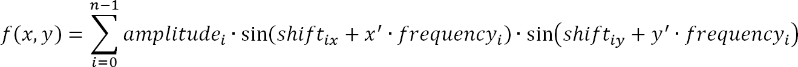
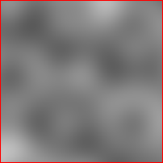
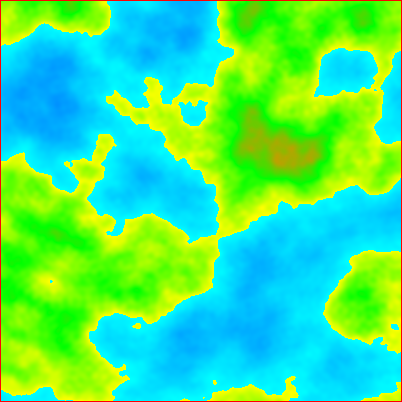
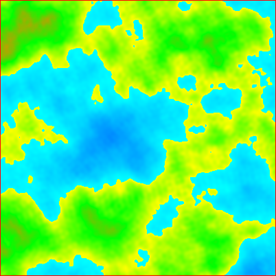

# bayoro-noise
Bayoro noise is a type of noise alternative to perlin, simplex and value noise.
The main difference is that the noise is calculated *in situ* meaning no other points are calculated except the point you want to get height in.

For now, the noise can't be looped in dimensions higher than 1D.


- [License](#License)
- [Theory](#theory)
	- [1D](#1d)
	- [2D](#2d)
- [Implementation](#implementation)
	- [JavaScript](#javascript)
		- [1D](#1d-1)
		- [2D](#2d-1)

## License
This is free and unencumbered software released into the public domain.

Anyone is free to copy, modify, publish, use, compile, sell, or
distribute this software, either in source code form or as a compiled
binary, for any purpose, commercial or non-commercial, and by any
means.

In jurisdictions that recognize copyright laws, the author or authors
of this software dedicate any and all copyright interest in the
software to the public domain. We make this dedication for the benefit
of the public at large and to the detriment of our heirs and
successors. We intend this dedication to be an overt act of
relinquishment in perpetuity of all present and future rights to this
software under copyright law.

THE SOFTWARE IS PROVIDED "AS IS", WITHOUT WARRANTY OF ANY KIND,
EXPRESS OR IMPLIED, INCLUDING BUT NOT LIMITED TO THE WARRANTIES OF
MERCHANTABILITY, FITNESS FOR A PARTICULAR PURPOSE AND NONINFRINGEMENT.
IN NO EVENT SHALL THE AUTHORS BE LIABLE FOR ANY CLAIM, DAMAGES OR
OTHER LIABILITY, WHETHER IN AN ACTION OF CONTRACT, TORT OR OTHERWISE,
ARISING FROM, OUT OF OR IN CONNECTION WITH THE SOFTWARE OR THE USE OR
OTHER DEALINGS IN THE SOFTWARE.

For more information, please refer to <http://unlicense.org/>

## Theory
The algorithm basically calculates a sum of scaled, rotated and shifted sinuses (called *coefficients* throughout the documentation), that are divided into layers.

Inspired by [the Weierstrass function](https://en.wikipedia.org/wiki/Weierstrass_function) and [the Fourier transform](https://en.wikipedia.org/wiki/Fourier_transform).
### 1D
#### Formula:


where:
`n` is the number of layers

`amplitude[i]` is the amplitude of i-th sinus (should decrease geometrically with each layer)

`shift[i]` is the shift of i-th sinus (has to be between 0 and 2π)

`frequency[i]` is the frequency of i-th sinus (should increase geometrically with each layer)


The generated noise will loop if all frequencies are multiples of π and the maximal value of `f(x)` is the sum of all amplitudes.
#### Visual example:
|Layer 0|Layer 1|Layer 2|Sum|
|-------|-------|-------|---|
|amplitude: 1<br>frequency: 1|amplitude: 0.5<br>frequency: 2|amplitude: 0.25<br>frequency: 4||
|||||

#### Pseudocode example:
```
let coefficients=[
	{
		shift: 2*PI*random(),
		amplitude: 1,
		frequency: 1
	},
	{
		shift: 2*PI*random(),
		amplitude: 0.5,
		frequency: 2
	},
	{
		shift: 2*PI*random(),
		amplitude: 0.25,
		frequency: 4
	},
];

function noise(x) {
	let sum=0; // variable to store the sum
	// iterate over all coefficients
	for (let i=0; i<n; ++i) {
		let coef=coefficients[i];
		sum+=coef.amplitude*sin(coef.shift+x*coef.frequency);
	}
	return sum;
}
```
### 2D
#### Formula:
The formula is pretty similar to its 1D version, but in order to hide vertical and horizontal lines layers have to be rotated and there should be multiple layers with the same frequency but different shifts and rotations.



where:
`n` is the number of layers

`x'` is the x-part of `(x, y)` rotated around `(0, 0)` by a random angle stored in current layer

`y'` is the y-part of `(x, y)` rotated around `(0, 0)` by a random angle stored in current layer

`amplitude[i]` is the amplitude of i-th sinus (should decrease geometrically with each layer)

`shift[ix]` is the x-shift of i-th sinus (has to be between 0 and 2π)

`shift[iy]` is the y-shift of i-th sinus (has to be between 0 and 2π)

`frequency[i]` is the frequency of i-th sinus (should increase geometrically with each layer)

Since every layer is randomly rotated the noise can't be looped.

#### Pseudocode example:
```
let coefficients=[
	{
		shiftx: 2*PI*random(),
		shifty: 2*PI*random(),
		angle: 2*PI*random(),
		amplitude: 1,
		frequency: 1
	},
	{
		shiftx: 2*PI*random(),
		shifty: 2*PI*random(),
		angle: 2*PI*random(),
		amplitude: 1,
		frequency: 1
	},
	{
		shiftx: 2*PI*random(),
		shifty: 2*PI*random(),
		angle: 2*PI*random(),
		amplitude: 0.5,
		frequency: 2
	},
	{
		shiftx: 2*PI*random(),
		shifty: 2*PI*random(),
		angle: 2*PI*random(),
		amplitude: 0.5,
		frequency: 2
	},
	{
		shiftx: 2*PI*random(),
		shifty: 2*PI*random(),
		angle: 2*PI*random(),
		amplitude: 0.25,
		frequency: 4
	},
	{
		shiftx: 2*PI*random(),
		shifty: 2*PI*random(),
		angle: 2*PI*random(),
		amplitude: 0.25,
		frequency: 4
	}
];

function noise(x) {
	let sum=0; // variable to store the sum
	// iterate over all coefficients
	for (let i=0; i<n; ++i) {
		let coef=coefficients[i];
		// rotation formula can be found on Wikipedia - https://en.wikipedia.org/wiki/Rotation_matrix#In_two_dimensions
		sum+=coef.amplitude*sin(coef.shift+(Math.cos(coef.angle)*x-Math.sin(coef.angle)*y)*coef.frequency)*sin(coef.shift+(Math.sin(coef.angle)*x+Math.cos(coef.angle)*y)*coef.frequency);
	}
	return sum;
}
```

## Implementation
### Javascript
#### 1D
```html
<html>
	<head>
	</head>
	<body>
		<canvas id="canvas" style="border: 1px red solid;" width="400" height="400"></canvas>
		<script>
			let canvas=document.getElementById("canvas");
			let ctx=canvas.getContext("2d");
			// set map size
			let size=canvas.width;
			// declare a function that returns the noise generator
			const createGenerator=(settings)=>{
				// settings contains:
				// layersCount - number of layers
				// mapIndexToAmplitude - function that maps a layer's index to its amplitude
				// mapIndexToFrequency - function that maps a layer's index to its frequency
				let generator={layers: []};
				for (let i=0; i<settings.layersCount; ++i) {
					let layer={};
					layer.shift=2*Math.PI*Math.random();
					layer.amplitude=settings.mapIndexToAmplitude(i);
					layer.frequency=settings.mapIndexToFrequency(i);
					generator.layers.push(layer);
				}
				generator.calculate=(x)=>{
					let sum=0;
					for (let i=0; i<generator.layers.length; ++i) {
						let layer=generator.layers[i];
						sum+=layer.amplitude*Math.sin(layer.shift+x*layer.frequency);
					}
					return sum;
				};
				return generator;
			};
			// initialize the generator with 10 layers and some basic index mapping
			let generator=createGenerator({
				layersCount: 10,
				mapIndexToAmplitude: (i)=>(Math.pow(2, -i-1)),
				mapIndexToFrequency: (i)=>(2*Math.PI/size*Math.pow(2, i)),
			});
			// display the noise
			for (let x=0; x<canvas.width; ++x) {
				let h=generator.calculate(x)*canvas.height/2;
				ctx.fillRect(x, canvas.height/2-h, 1, canvas.height/2+h)
			}
		</script>
	</body>
</html>
```
#### 2D
```html
<html>
	<head>
		<style>
		</style>
	</head>
	<body>
		<canvas id="canvas" style="border: 1px red solid;" width="400" height="400"></canvas>
		<script>
			let canvas=document.getElementById("canvas");
			let ctx=canvas.getContext("2d");
			let size=canvas.width;
			// declare a function that returns the noise generator
			const createGenerator=(settings)=>{
				// settings contains:
				// layersCount - number of layers
				// mapIndexToAmplitude - function that maps a layer's index to its amplitude
				// mapIndexToFrequency - function that maps a layer's index to its frequency
				let generator={layers: []};
				for (let i=0; i<settings.layersCount; ++i) {
					let layer={};
					layer.angle=2*Math.PI*Math.random()
					layer.shiftx=2*Math.PI*Math.random();
					layer.shifty=2*Math.PI*Math.random();
					layer.amplitude=settings.mapIndexToAmplitude(i);
					layer.frequency=settings.mapIndexToFrequency(i);
					generator.layers.push(layer);
				}
				generator.calculate=(x, y)=>{
					let sum=0;
					for (let i=0; i<generator.layers.length; ++i) {
						let layer=generator.layers[i];
						sum+=layer.amplitude*Math.sin(layer.shiftx+(x*Math.cos(layer.angle)-y*Math.sin(layer.angle))*layer.frequency)*Math.sin(layer.shifty+(x*Math.sin(layer.angle)+y*Math.cos(layer.angle))*layer.frequency);
					}
					return sum;
				};
				return generator;
			};
			// initialize the generator with 10 layers and some basic index mapping
			let generator=createGenerator({
				layersCount: 120,
				mapIndexToAmplitude: (i)=>(Math.pow(2, -(Math.floor(i/20))-1)/20),
				mapIndexToFrequency: (i)=>(2*Math.PI/size*Math.pow(2, Math.floor(i/20))),
			});
			// display the noise
			for (let x=0; x<canvas.width; ++x) {
				for (let y=0; y<canvas.height; ++y) {
					let h=generator.calculate(x, y)*3;
					// dark blue to cyan (water)
					if (h < 0) ctx.fillStyle="rgb("+(0)+","+(255+255*h)+","+(255)+")"
					// yellow to green (beach)
					else if (h < 0.25) ctx.fillStyle="rgb("+(255-255*h*4)+","+(255)+","+(0)+")";
					// green to orange
					else if (h < 0.5) ctx.fillStyle="rgb("+((h-0.25)*4*255)+","+(255-(h-0.25)*2*255)+","+(0)+")";
					// orange to red (hill)
					else if (h < 0.75) ctx.fillStyle="rgb("+(255)+","+(255/2-(h-0.5)*4*255/2)+","+(0)+")";
					// red to white (mountain)
					else if (h < 1) ctx.fillStyle="rgb("+(255)+","+(0+(h-0.75)*4*255)+","+(0+(h-0.75)*4*255)+")";
					// white (off scale mountain)
					else ctx.fillStyle="rgb("+(255)+","+(255)+","+(255)+")";
					ctx.fillRect(x, y, 1, 1);
				}
			}
		</script>
	</body>
</html>
```

